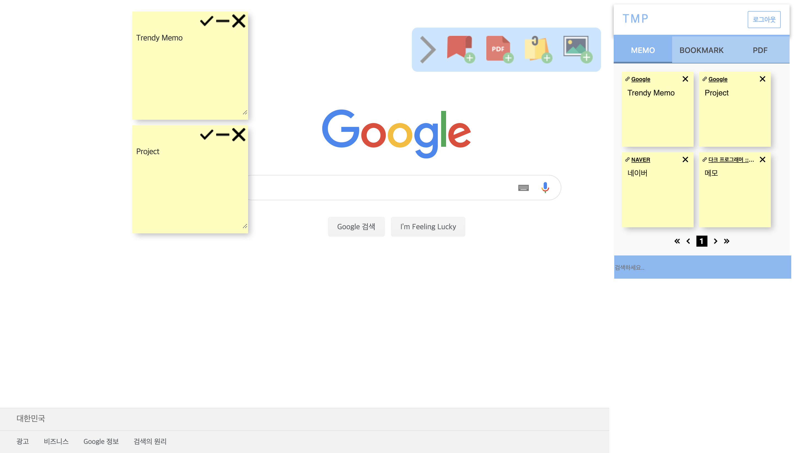

# Trendy Memo Project 
Chrome extension for live memo including text memo and drawing memo on every websites. Also, combined with bookmark function including taking a snapshot and PDF export function can track files on Firebase server.

## Run `yarn install` after adding a package

## To build this project:

`npm start build` or  
`yarn build` (package manager `yarn` installation required)

## Libraries

* [Pdfcrowd](https://pdfcrowd.com/)
* [Material-UI](https://material-ui.com/getting-started/installation/)
* [Painterro](https://github.com/ray5273/painterro)
* [Firebase](https://firebase.google.com/?hl=ko)
* [React.js](https://reactjs.org/)
* [React-draggable](https://github.com/mzabriskie/react-draggable)

## Issue
Cross-Origin Read Blocking Issue not solved yet.
